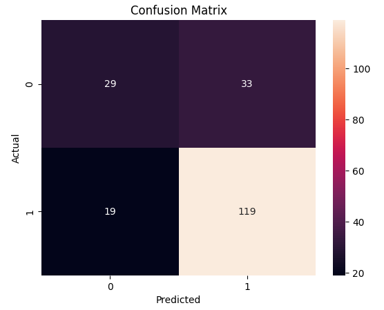
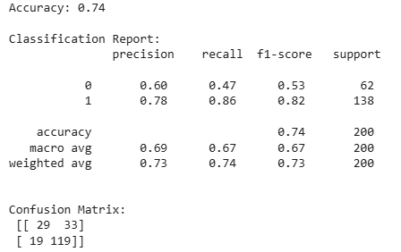
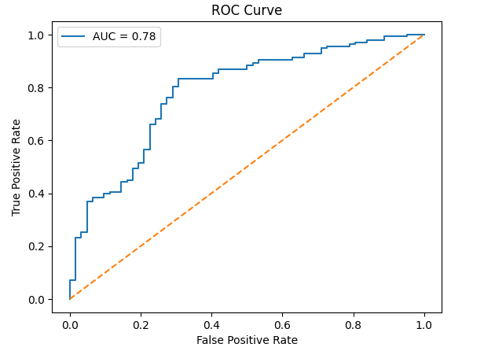
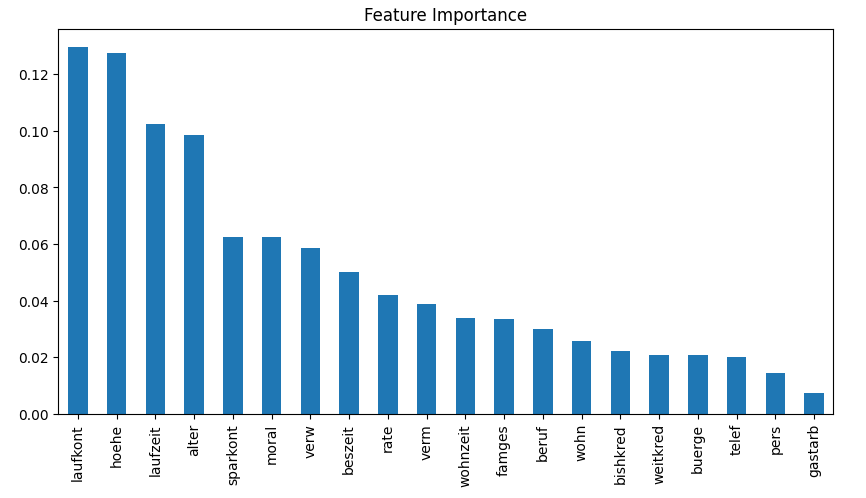
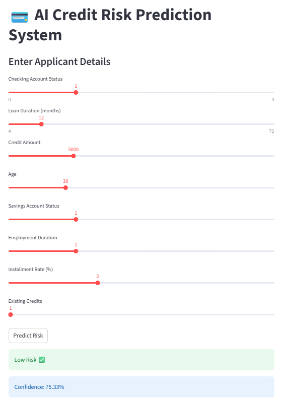

💳 AI-Driven Credit Risk Prediction System

Credit Risk Prediction using Machine Learning (Random Forest Classifier) with 74% Accuracy and 0.78 AUC Score.

📌 Project Overview

This project predicts whether a loan applicant is High Risk or Low Risk using a Machine Learning classification model.

The system helps financial institutions assess creditworthiness and reduce potential loan defaults.

The Random Forest model achieved:

Accuracy: 74%

AUC Score: 0.78

Strong performance in identifying low-risk applicants.

📂 Dataset

German Credit Dataset (UCI / Kaggle)

1000 records

20 features

Target Variable: kredit (0 = High Risk, 1 = Low Risk)

⚙️ Technologies Used

Python

Pandas

Scikit-learn

Matplotlib

Seaborn

Google Colab

Streamlit (Web Deployment)

🧠 Model Implemented
🌳 Random Forest Classifier

Supervised Learning Algorithm

Handles non-linear relationships effectively

Uses ensemble learning (multiple decision trees)

Class weight balancing applied

📊 Model Evaluation

The model was evaluated using:

Accuracy Score

Classification Report

Confusion Matrix

ROC Curve

AUC Score

Confusion Matrix Results

True Positives: 119

True Negatives: 29

False Positives: 33

False Negatives: 19

The model performs well in identifying low-risk customers.

📈 ROC Curve

AUC Score: 0.78

Indicates good discrimination capability between risk classes.

📊 Feature Importance

The most influential factors affecting credit risk:

Checking Account Status (laufkont)

Credit Amount (hoehe)

Loan Duration (laufzeit)

Age (alter)

Savings Account (sparkont)

This insight helps financial institutions understand key drivers of risk.

🚀 Web Application

The model is deployed using Streamlit.

Users can:

Enter applicant details

Get instant credit risk prediction

View confidence probability

🔮 Future Improvements

Hyperparameter tuning

Cross-validation optimization

SHAP-based Explainable AI

Cloud deployment scaling

Integration with real-time banking APIs

💼 Business Impact

This system can help:

Reduce loan default risk

Improve decision-making efficiency

Automate credit approval process

Enhance financial risk assessment

👨‍💻 Author

Deepankar
Aspiring Data Analyst | Machine Learning Enthusiast

🔗 GitHub Repository

https://github.com/Deepankar523/Credit-Risk-Prediction-App

🔗 Streamlit link

https://credit-risk-prediction-app-ntstwrcz2jxvy5ziu8mmip.streamlit.app/

## 📊 Model Evaluation

### Confusion Matrix

### Classification Report

### ROC Curve

### Feature Importance

## 🌐 Web Application

